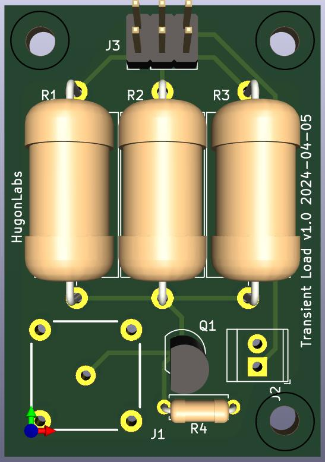
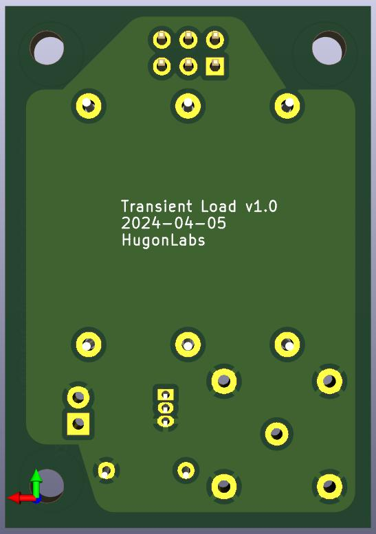

# KiCad Transient Load

For step-response testing power supplies.

A resistor and MOSFET switch hooked up to a BNC jack. Hook up a signal
generator to the BNC jack and the other leads to the power supply device under
test.

